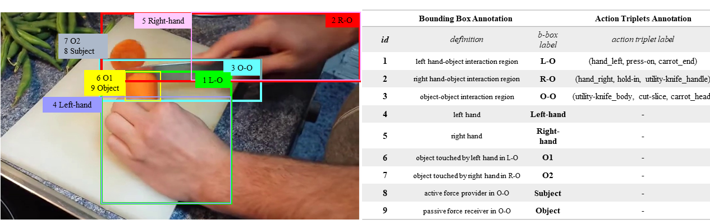
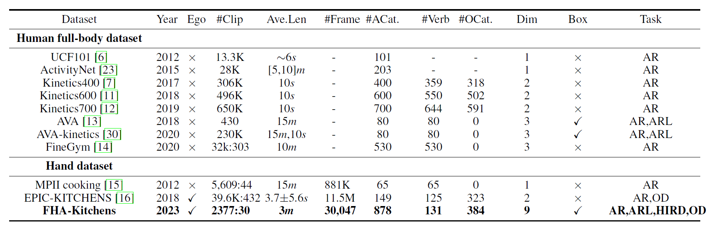
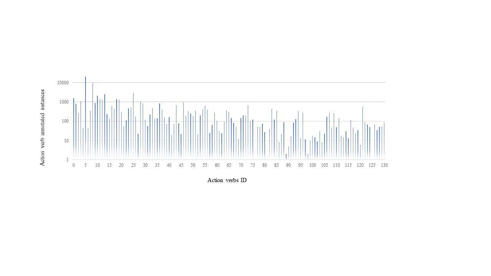
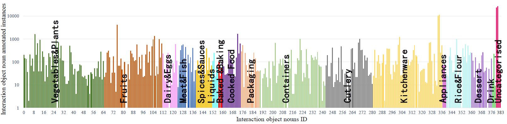
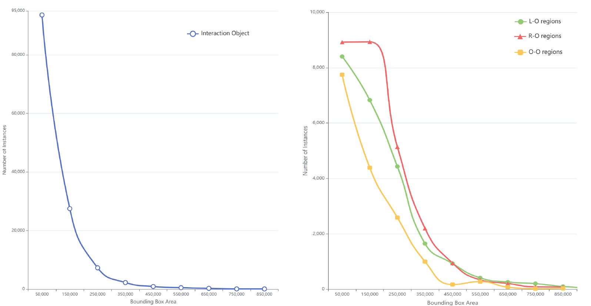
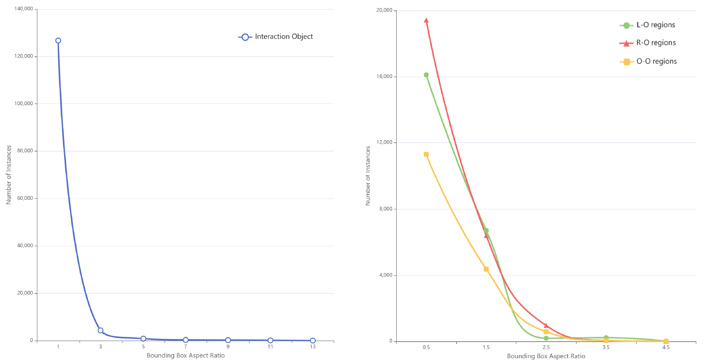
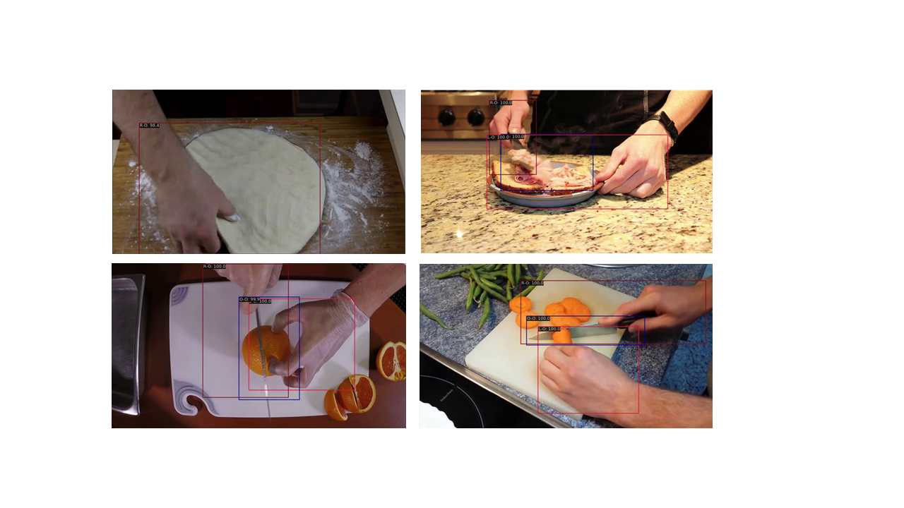

<h1 align="center"> FHA-Kitchens: A Novel Dataset for Fine-Grained Hand Action Recognition in Kitchen Scenes </h1>

<a href="https://arxiv.org/abs/2306.10858">"></a>

<h5 align="center"><em>Ting Zhe, Yongqian Li, Jing Zhang, Yong Luo, Han Hu, Bo Du, Yonggang Wen, Dacheng Tao</em></h5>

  <a href="#news">News</a> |
  <a href="#introduction">Abstract</a> |
  <a href="#usage">Usage</a> |
  <a href="#results">Results</a> |
  <a href="#statement">Statement</a>

# News

**2023.08.21**

- We have uploaded annotation information for the validation set and a video demo of bounding box annotations for different interaction regions for review.

**2023.06.21**

- The tech report is post on arxiv! Work in progress.

# Introduction
This is the official repository of the paper <a href="https://arxiv.org/abs/2306.10858"> FHA-Kitchens: A Novel Dataset for Fine-Grained Hand Action Recognition in Kitchen Scenes.

<figure>

<figcaption align = "center"><b>Figure 1: Overview of the FHA-Kitchens dataset. The top shows some frames extracted from 8 dish categories. The bottom illustrates the annotation process of fine-grained actions in “fry vegetable”. 
 </b></figcaption>
</figure>

 In this paper, we present a novel dataset, namely the FHA-Kitchens dataset, which focuses on fine-grained hand actions observed in kitchen scenes. The FHA-Kitchens dataset encompasses a total of 2,377 video clips and 30,047 images, all extracted from eight different dish types. Each frame within the dataset is accompanied by meticulously labeled hand interaction regions, featuring high-quality annotations of fine-grained action categories and bounding boxes. The dataset can be used for supervised learning for hand interaction region and object detection (SL-D), supervised learning for fine-grained hand action recognition (SL-AR), and intra- and inter-class domain generalization for hand interaction region detection (DG). The experimental results offer compelling empirical evidence that highlights the challenges inherent in fine-grained hand action recognition, while also shedding light on potential avenues for future research, particularly in relation to pre-training strategy, model design, and domain generalization.

# Usage
The code and dataset will be released soon.

# Annotation Details
## Visualization for annotations
 <figure>

<figcaption align = "center"><b>Figure 2: Left: Visualization of bounding box annotations for the example of "fry vegetables". Right: Descriptive list of action triplets and bounding box annotations.  
 </b></figcaption>
</figure>

## Demo of bounding box annotations for different interaction regions
 
https://github.com/tingZ123/FHA-Kitchens/assets/35674945/8e2a9ddd-3244-479f-b48c-5e108b1541e0 
  
# Results
## The comparison information of relevant datasets

<figure>

<figcaption align = "center"><b>Figure 3: Comparison of relevant datasets. AR: Action Recognition. ARL: Action Region Localization. HIA: Hand Interaction Region Detection. OD: Object Detection. ACat.: Action Category. OCat.: Object Category. Dim: Action Dimension. Box: Box Annotation of Action Region. 
 </b></figcaption>
</figure>

A comprehensive comparison between our FHA-kitchens and existing datasets.

## Dataset Statistics and Analysis
### The action verb categories distribution.

<figure>

<figcaption align = "center"><b>Figure 4: An overview of the action verbs and their parent action categories in FHA-Kitchens.</a>  
 </b></figcaption>
</figure>

<figure>

<figcaption align = "center"><b>Figure 5: The distribution of instances per action verb category (the outer ring of the circle in Fig. 4) in the FHA-Kitchens dataset.</a>  
 </b></figcaption>
</figure>

  
Verbs: The annotated dataset comprises 131 action verbs that have been grouped into 43 parent verb categories (Figure 4 and Figure 5). The three most prevalent parent verb categories, based on the count of sub-action verbs, are Cut, Hold, and Take, representing the most frequently occurring hand actions in human interactions. Figure 5 visually depicts the distribution of all verb categories within FHA-Kitchens, ensuring the presence of at least one instance for each verb category.

### The interaction object noun categories distribution.

<figure>

<figcaption align = "center"><b>Figure 6: The distribution of instances per object noun category from 17 super-categories in the FHA-Kitchens dataset.</a>  
 </b></figcaption>
</figure>

  
Nouns: In our annotation process, we identified a total of 384 interaction object noun categories that are associated with actions, categorized into 17 super-categories. Figure 6 shows the distribution of noun categories based on their affiliations with super-categories. Notably, the super-category ''vegetables & plants'' exhibits the highest number of sub-categories, followed by ''kitchenware'', which aligns with typical kitchen scenes.

### The action triplet categories distribution.
  
  <figure>

<figcaption align = "center"><b>Figure 7: The distribution of instances per action triplet category in the FHA-Kitchens dataset.</a>  
 </b></figcaption>
</figure>

  The distribution of instances per action triplet category in FHA-Kitchens, as depicted in Figure 7, depicts a long-tail property. This distribution reflects the frequency of hand interactions in real-world kitchen scenes, taking into account the varying commonness or rarity of specific hand actions. For instance, the action triplet (hand_right, hold-in, utility-knife_handle) consists of 9,887 instances, which is nine times more prevalent than the (hand_left, hold-in, utility-knife_handle) triplet. This long-tail characteristic of the distribution renders FHA-Kitchens a challenging benchmark for hand action recognition, making it suitable for investigating few-shot learning and out-of-distribution generalization in action recognition as well.
 
### Statistics of bounding box.
  
 <figure>

<figcaption align = "center"><b>Figure 8: The distributions of bounding box areas of interaction objects (left) and interaction regions (right) in the FHA-Kitchens dataset.</a>  
 </b></figcaption>
</figure>

<figure>

<figcaption align = "center"><b>Figure 9: The distributions of bounding box aspect ratios of interaction objects (left) and interaction regions (right) in the FHA-Kitchens dataset.</a>  
 </b></figcaption>
</figure>

  
  We performed a comprehensive statistical analysis on the bounding boxes of the three hand interaction regions and the corresponding interaction objects. Specifically, we focused on two aspects: the box area and the aspect ratio. Detailed results can be found in Figures 8 and Figure 9. Figure 8 shows the considerable range of sizes covered by our bounding boxes, with many interaction objects exhibiting small and challenging sizes for accurate detection. Moreover, in Figure 9, the aspect ratios of the bounding boxes exhibit notable variation. The aspect ratios of the three regions tend to concentrate within the range of [0.5,2], which can be attributed to the typical composition of interaction regions involving two interacting objects. Consequently, the bounding box encompasses the combined region of both objects. For instance, the R-O interaction region frequently involves the interaction between the ''right hand'' and ''utility knife''. In such cases, the aspect ratio of the bounding box is observed to be 2:1, as depicted in Figure 2. These findings highlight the significant challenges of the detection task in our dataset.
  
  

## Visualization of Interaction Regions detection
  
<figure>

<figcaption align = "center"><b>Figure 8: Some visual examples of interaction region detection using annotated data from our dataset.
 </b></figcaption>
</figure>

# Statement

This project is for research purpose only. For any other questions please contact [zheting@whu.edu.cn](mailto:zheting@whu.edu.cn).

## Citation

