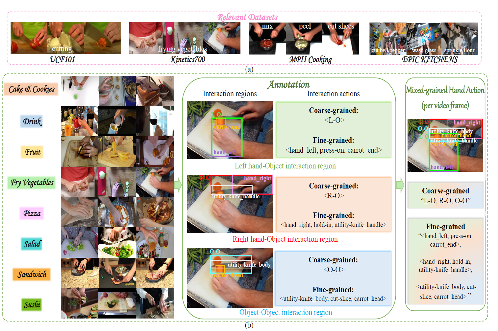
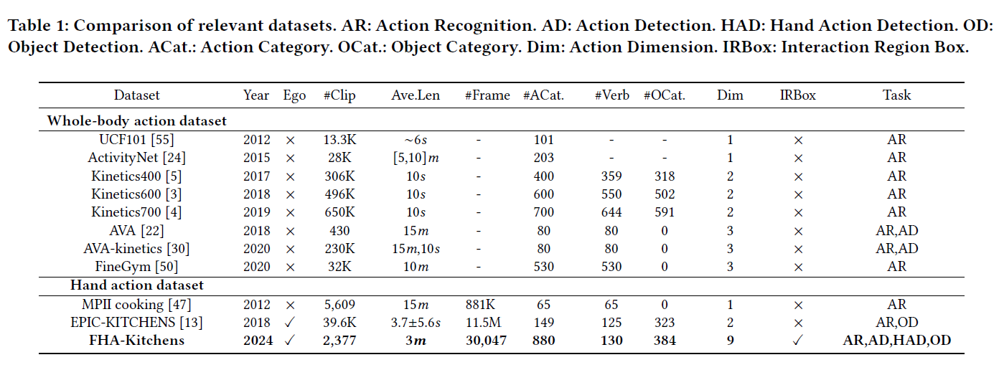
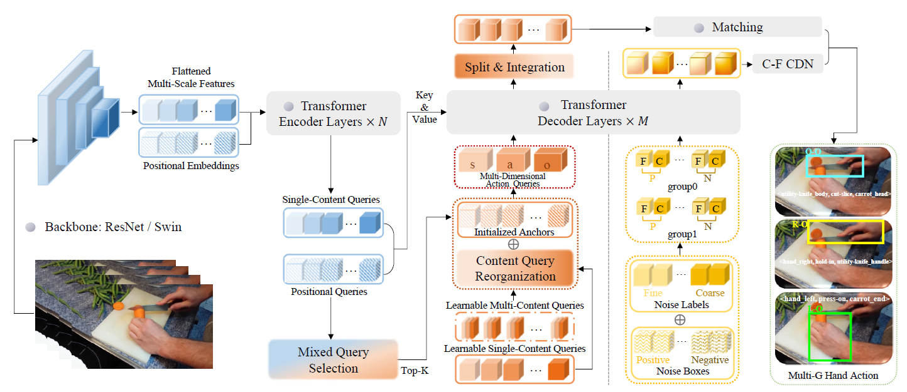
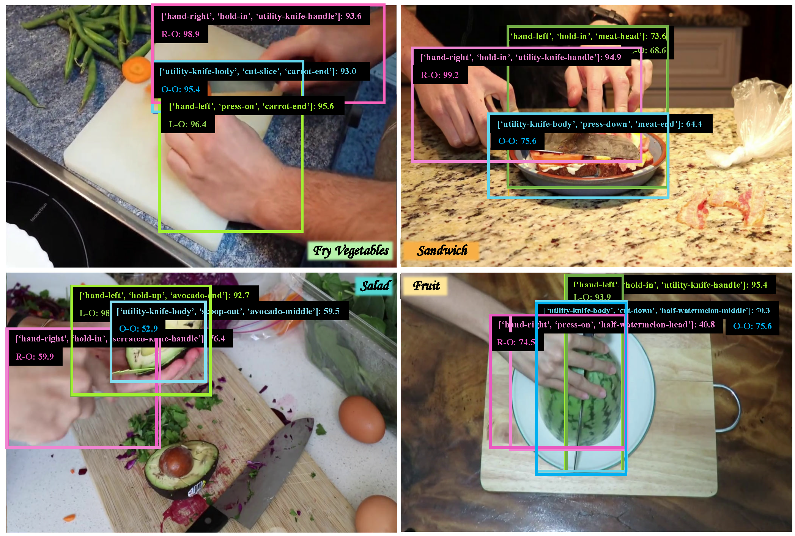

<h1 align="center"> Multi-Granularity Hand Action Detection </h1>

<p align="center">
  <a href="#News">News</a> |
  <a href="#Abstract">Abstract</a> |
  <a href="#Dataset">Dataset</a> |
  <a href="#Method">Method</a> |
  <a href="#Results">Results</a> |
  <a href="#Statement">Statement</a>
</p>


# News

**2024.07.16**

- The paper "Multi-Granularity Hand Action Detection" has been accepted by the 32nd ACM International Conference on Multimedia (MM ’24). We will release the dataset and related code soon.


# Abstract
Detecting hand actions in videos is crucial for understanding video content and has diverse real-world applications. Existing approaches often focus on whole-body actions or coarse-grained action categories, lacking fine-grained hand-action localization information. To fill this gap, we introduce the FHA-Kitchens (Fine-Grained Hand Actions in Kitchen Scenes) dataset, providing both coarse- and fine-grained hand action categories along with localization annotations. This dataset comprises 2,377 video clips and 30,047 frames, annotated with approximately 200k bounding boxes and 880 action categories. Evaluation of existing action detection methods on FHA-Kitchens reveals varying generalization capabilities across different granularities. To handle multi-granularity in hand actions, we propose MG-HAD, an End-to-End Multi-Granularity Hand Action Detection method. It incorporates two new designs: Multi-dimensional Action Queries and Coarse-Fine Contrastive Denoising. Extensive experiments demonstrate MG-HAD's effectiveness for multi-granularity hand action detection, highlighting the significance of FHA-Kitchens for future research and real-world applications.

<div align=center>

</div>
Overview of the FHA-Kitchens dataset. (a) The annotation of hand actions in existing relevant datasets, where UCF101 and Kinetics700 are whole-body action datasets, while MPII Cooking and EPIC KITCHENS are hand action datasets. (b) The annotation of hand actions in our dataset. The left shows some frames extracted from 8 dish categories. The right illustrates the annotation process of hand actions in “fry vegetable”.

# Dataset
To the best of our knowledge, we are the first to study the problem of multi-granularity hand action detection and establish the first hand-action dataset, FHA-Kitchens, which includes both hand interaction region localization and multi-granularity category annotations. This dataset can serve as a benchmark for hand action detection tasks. FHA-Kithcnes dataset and original annotation files can be downloaded [here](https://drive.google.com/open?id=1WI-gsNLS-t0Kh8TVki1wXqc3y2Ow1f2R). 
<div align=center>

</div>
Overview of the FHA-Kitchens dataset. (a) The annotation of hand actions in existing relevant datasets, where UCF101 and Kinetics700 are whole-body action datasets, while MPII Cooking and EPIC KITCHENS are hand action datasets. (b) The annotation of hand actions in our dataset. The left shows some frames extracted from 8 dish categories. The right illustrates the annotation process of hand actions in “fry vegetable”.

<div align=center>

</div>
Comparison of relevant datasets. AR: Action Recognition. AD: Action Detection. HAD: Hand Action Detection. OD: Object Detection. ACat.: Action Category. OCat.: Object Category. Dim: Action Dimension. IRBox: Interaction Region Box.

## Demo of bounding box annotations for different interaction regions

https://github.com/superZ678/FHA-Kitchens/assets/35674945/16f7d614-3738-494b-baf9-4a394b628d28


# Method
We propose a novel multi-granularity hand action detection method named MG-HAD, which is designed from the perspectives of multi-granularity and multi-dimensionality. This method incorporates Multi-dimensional Action Queries and a Coarse-Fine Contrastive Denoising module to address the mixed-grained HAD problem. MG-HAD demonstrates its effectiveness in hand action detection and could serve as a strong baseline.

<div align=center>

</div>


# Result
Visual detection results of our method in four different kitchens scenarios containing complex hand actions, i.e., “fry  vegetables”, “sandwich”, “salad”, and “fruit”. Our model offers accurate bounding boxes and multi-granularity hand action information for three hand sub-interaction regions.
<div align=center>

</div>

# Statement

This is the official repository of the paper Multi-Granularity Hand Action Detection. This project is for research purposes only. For further questions, please contact Ting Zhe at zheting@whu.edu.cn.


## Citation

```bibtex
@inproceedings{zhe2024multi,
  title={Multi-Granularity Hand Action Detection},
  author={Zhe, Ting and Zhang, Jing and Li, Yongqian and Luo, Yong and Hu, Han and Tao, Dacheng},
  booktitle={Proceedings of the 32nd ACM International Conference on Multimedia},
  pages={5604--5613},
  year={2024}
}
```
